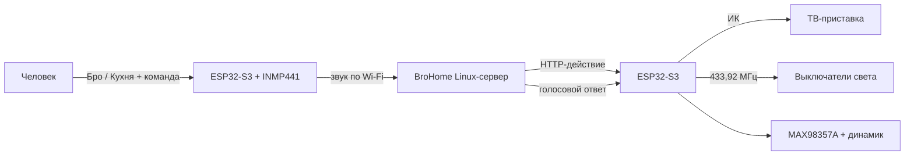

# BroHome Control Hub

> **Первый раз собираете ESP32-проект?** [Скачайте последний установочный выпуск](https://github.com/Nikolay-3D/brohome-control-hub/releases/latest) и откройте [пошаговую инструкцию «Начните здесь»](START_HERE.md). Git знать не требуется.

Открытый голосовой хаб на ESP32-S3 для управления ИК-техникой и светом 433,92 МГц. Он обучается с оригинальных пультов через браузер, хранит команды во flash-памяти, передаёт голос на домашний Linux-сервер и воспроизводит ответы через собственный динамик.

В проекте нет ADB и облачного «умного пульта»: телевизионная приставка управляется настоящим ИК-сигналом ESP32. Wi-Fi-пароли и адрес сервера хранятся только в локальном файле `secrets.h`, который Git игнорирует.

## Возможности

- обучение и повтор ИК-команд;
- обучение и повтор обычных OOK/ASK-команд 433,92 МГц через CC1101;
- веб-страница для обучения, теста, удаления и создания голосовых действий;
- несколько сигналов в одном действии — например, включить обе половины люстры;
- микрофон INMP441 и динамик через MAX98357A;
- локальное обнаружение слов «Бро» и «Кухня» с Vosk;
- цифровое усиление микрофона с ограничителем перегрузки и фильтром низкочастотного гула;
- распознавание последующей команды и озвучивание ответа;
- московское время, температура, телеканалы, свет и пользовательские действия;
- JSON-копия всех обученных пультов на компьютере;
- установка сервера одной командой как службы systemd.

## Быстрый маршрут

1. Купите модули по [перечню деталей](docs/BOM.md).
2. Соберите их строго по [схеме подключения](docs/WIRING.md). CC1101 питается только от 3,3 В.
3. Прошейте ESP32 по [инструкции для контроллера](esp32/esp32-s3-devkitc-1/brohome_control_hub/README.md).
4. На Debian/Ubuntu x86-64 выполните:

   ```bash
   git clone https://github.com/Nikolay-3D/brohome-control-hub.git
   cd brohome-control-hub
   sudo bash install.sh
   ```

5. Откройте IP-адрес ESP32 в браузере, обучите кнопки и создайте голосовые действия.
6. Скажите: «Бро, время», «Кухня, время» или одну из [готовых команд](docs/COMMANDS.md).
7. Скачайте backup JSON с веб-страницы хаба и сохраните его вне устройства.

Полная пошаговая настройка: [docs/INSTALLATION.md](docs/INSTALLATION.md). Если что-то не заработало: [docs/TROUBLESHOOTING.md](docs/TROUBLESHOOTING.md).

## Как всё связано



Подробности: [архитектура](docs/ARCHITECTURE.md), [индикация](docs/LED.md), [резервные копии](docs/BACKUP.md), [безопасность](SECURITY.md).

## Важные ограничения

- Клонируются только совместимые фиксированные RF-коды. Rolling code автомобильных брелоков и ворот этим способом не копируется.
- Распознавание полной фразы использует Google Speech Recognition и требует Интернета. Слова активации «Бро» и «Кухня» распознаются локально.
- В репозитории нет домашних сигналов пультов: они индивидуальны и сохраняются пользователем в JSON.
- Готовые wheel-файлы рассчитаны на Linux x86-64 и Python 3.10–3.12.

## Лицензия

MIT — см. [LICENSE](LICENSE). Используйте передатчики только для принадлежащих вам устройств и с соблюдением местных правил радиосвязи.
